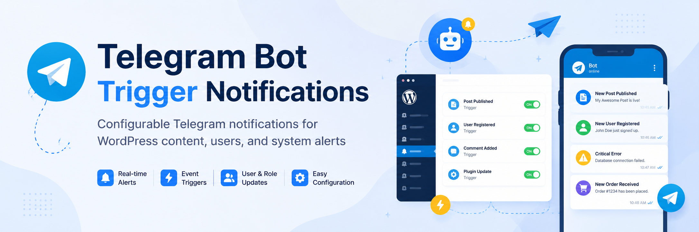

# Telegram Bot Trigger Notifications

Author: Neth

Telegram Bot Trigger Notifications is a modular WordPress plugin that sends real-time Telegram messages for content activity, user actions, system updates, and optional third-party integrations.



## Requirements

- WordPress 6.9 or newer
- PHP 8.2 or newer

Build information: **18 សីហា 2026, 09:10:22 (Asia/Phnom_Penh)**.

## Structure

```
.
├── telegram-bot.php
├── includes/
│   ├── class-plugin.php
│   ├── class-telegram-api.php
│   ├── class-settings.php
│   ├── class-trigger-manager.php
│   ├── class-notification-manager.php
│   ├── class-template-manager.php
│   ├── class-logger.php
│   └── helpers.php
├── admin/
│   ├── class-admin.php
│   └── views/
│       ├── dashboard.php
│       ├── telegram-settings.php
│       ├── triggers.php
│       ├── alerts.php
│       ├── datetime.php
│       ├── templates.php
│       └── logs.php
├── modules/
│   ├── class-news-module.php
│   ├── class-document-module.php
│   ├── class-user-module.php
│   ├── class-plugin-monitor.php
│   └── class-system-monitor.php
├── assets/
├── languages/
├── uninstall.php
├── readme.txt
└── README.md
```

## Admin access

The **Telegram-Bot** menu and all subpages require the `manage_options` capability. By default, this capability is available only to Administrators, so Editors and other lower roles cannot see the plugin dashboard.

## Getting started

1. Upload this plugin folder to `/wp-content/plugins/`.
2. Activate the plugin.
3. Open **Telegram-Bot → Telegram Settings**.
4. Add your BotFather token and chat ID.
5. Return to **Dashboard** and send a test message.
6. Customize notification wording under **Message Format** if needed.
7. Enable the triggers under **Triggers** and **Alerts**.

## Using the plugin in WordPress

- **Dashboard** shows connection readiness, setup progress, recipient count, enabled feature groups, and the test-message action.
- **Telegram Settings** manages the BotFather token, chat IDs, parse mode, link previews, and duplicate suppression.
- **Triggers** controls notifications for content, media, comments, WooCommerce, and supported form plugins.
- **Alerts** controls user actions, login/security events, system changes, and scheduled available-update digests.
- **Date & Time Format** controls DMY, MDY, or YMD order; numeric or named months; 2/4-digit years; separators; 12/24-hour clocks; optional seconds; and the message timezone. Cambodia time (`Asia/Phnom_Penh`) is the default, with an option to follow the WordPress site timezone.
- **Message Format** customizes icons, labels, field order, and dynamic placeholders for content, user, system, comment, failed-login, integration, update-digest, and test messages. Optional user roles can be shown or hidden.
- **Templates & Developer** documents the shortcode, action hook, helper function, and message filter.
- **Logs** provides recent diagnostic information without logging bot tokens or private authentication data.

## Release packages

The source repository is hosted at:

```text
neth-ai/Telegram-Trigger-Wordpress
```

For the initial `v1.0.0` release, create an installable package named:

```text
telegram-trigger-v1.0.0.zip
```

Build it from the repository root with:

```bash
./build-release.sh
```

The ZIP must contain one top-level `telegram-trigger/` folder so the installed directory matches the plugin text domain. Do not install GitHub's automatically generated source archive: its versioned top-level directory does not match the plugin text domain and includes repository-only files.

Release ZIP files are build artifacts and are ignored by Git. This plugin follows the standard WordPress update system and does not modify WordPress update transients. GitHub builds can be updated manually by installing the newer release package.

## Custom development

Shortcode:

```php
[myp_telegram message="Hello from WordPress"]
```

Action hook:

```php
do_action( 'myp_telegram_send', 'Your message here' );
```

Message filter:

```php
add_filter( 'myp_telegram_message', function ( $message, $context ) {
    return $message . "\nEvent: " . $context['event'];
}, 10, 2 );
```
